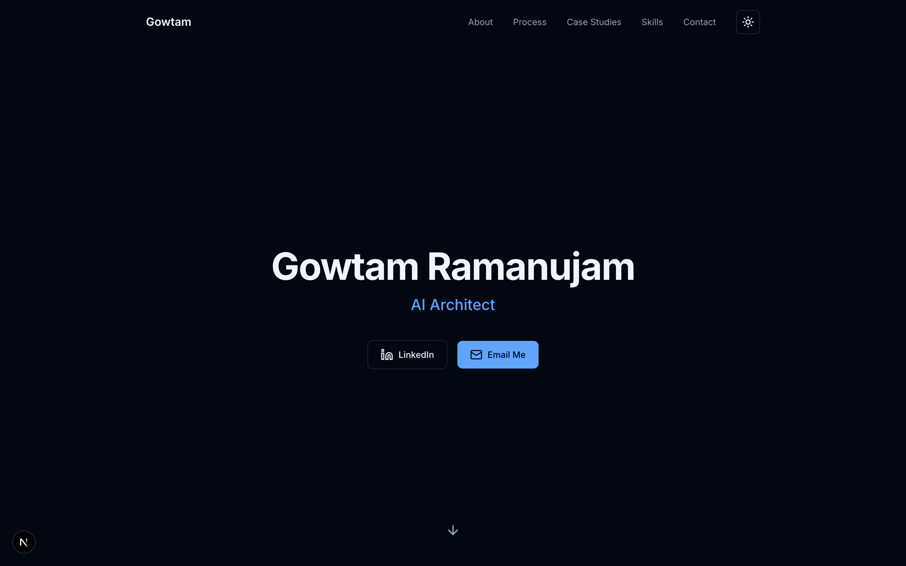
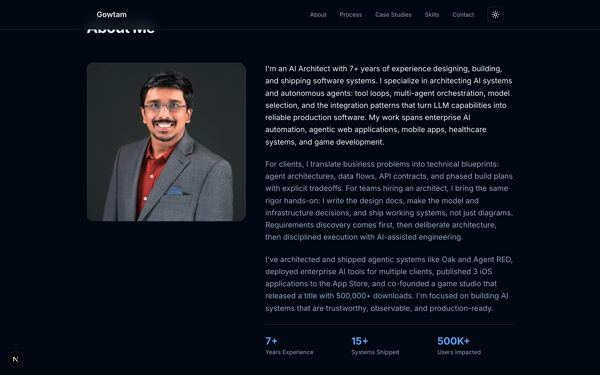
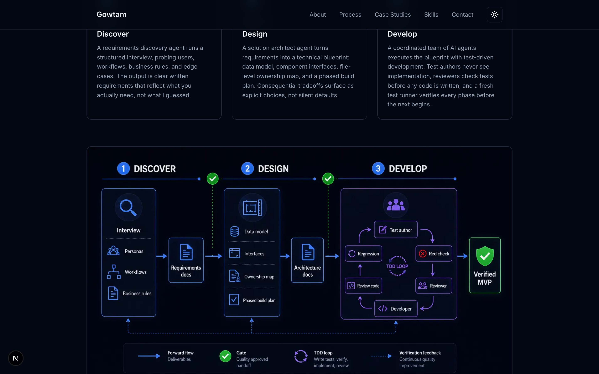
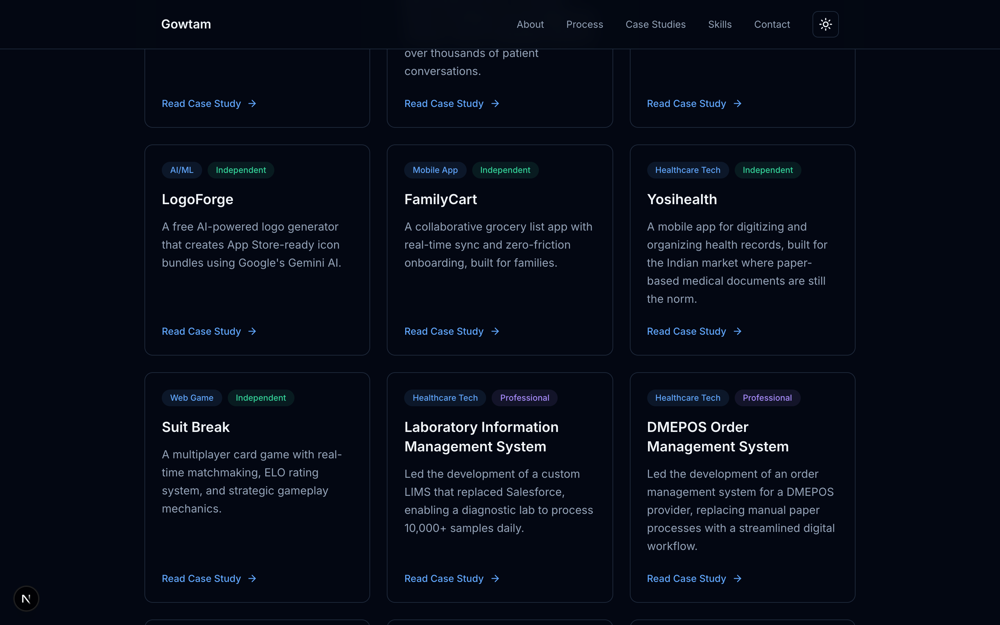
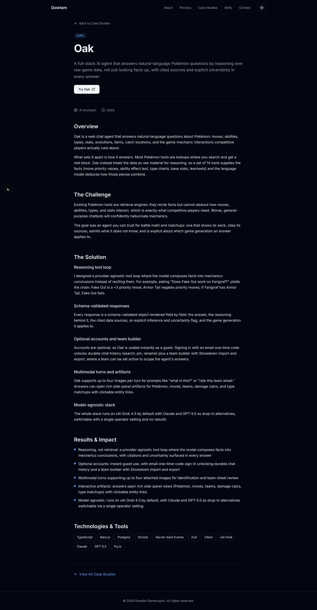
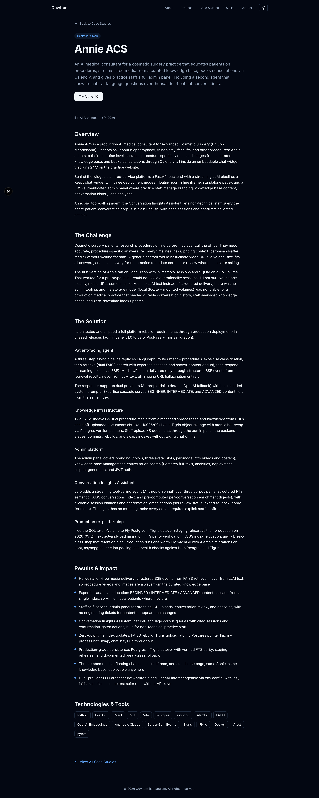
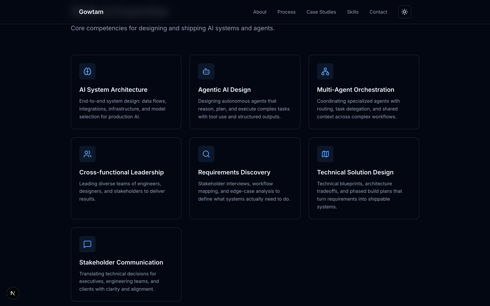
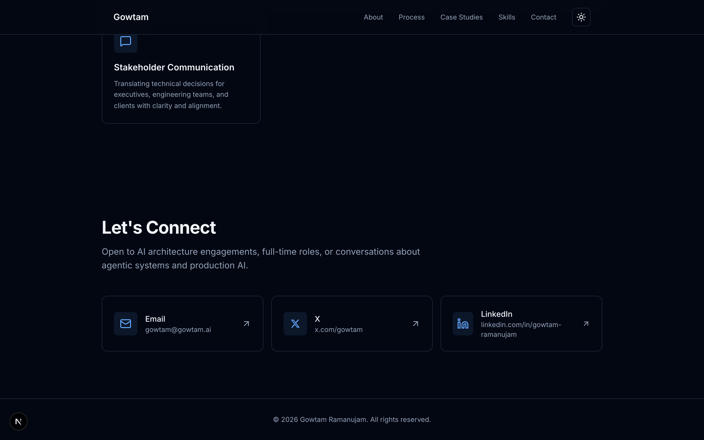
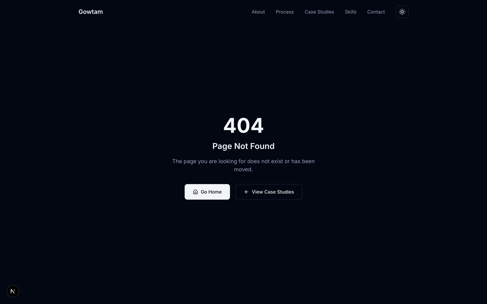

# UI Design Strategy - gowtam.ai

> **Superseded (2026-07).** The live site now follows **Warm Authority** (Fraunces + Plus Jakarta Sans, warm ink/cream, copper accent, photo-forward hero). See `docs/design/redesign-preview.html` and current `src/app/globals.css`. This document is historical: the earlier "spec sheet, elevated" pass that shipped and later felt too robotic.

> Fable design pass · 2026-07-05 · commit 264ba79
> Seen via: live screenshots (dev server, dark + light themes, desktop + mobile), plus a full design-token inventory of the source
> Status: **historical.** Do not re-apply this direction without explicit request.

## TL;DR

- **The diagnosis in one line:** the site is wearing Tailwind's defaults with perfect discipline - Inter at stock sizes, the stock blue, border-only cards on one flat plane, zero motion, and thirteen equal-weight text cards - so a portfolio arguing for architectural judgment shows none in its own pixels, and the strong content reads like a well-formatted README.
- **The direction:** "the spec sheet, elevated" - the calm, precise confidence of a beautifully typeset engineering document. Monospace metadata, hairline rules, graphite neutrals, one decisive ember accent, and the evidence (real diagrams, real numbers) doing all the decorating. References: Linear, Stripe, Vercel/Geist.
- **The three highest-impact moves:** (1) the type + color foundation swap (Instrument Sans + IBM Plex Mono, graphite ramp + ember accent, mono section labels), (2) a rebuilt left-aligned hero with a hairline schematic of a real agent loop as the site's one moment of motion, (3) case-study hierarchy: two featured flagships with visuals, the rest as a compact index, and detail pages restructured as spec documents with stat callouts.

## 1. Diagnosis - why it reads as generic today

The content is genuinely strong: the writing is specific, the case studies contain real architecture decisions, and the code discipline (pure CSS-variable consumption, consistent spacing) makes a retoken cheap. The problem is that every *visual* decision is a framework default. Point by point:

### Systemic tells (repeat on every screen - fixed once, in the Foundation)

- **Typography has no voice and no register.** Inter everywhere, at stock Tailwind steps (`text-6xl` hero, `text-3xl/4xl` section heads, 18-20px gray body). Nothing separates this from every Tailwind starter shipped since 2021. Worse for this site specifically: a deeply technical portfolio with **no monospace anywhere** - no technical register for metadata, stats, labels, or stack lists. (lens: typography; evidence: inventory + every screenshot)
- **The palette is Tailwind's, not Gowtam's.** Dark bg `#030712` (stock gray-950), accent `#60a5fa`/`#2563eb` (stock blue-400/600), badges in stock emerald and violet. Only four neutrals exist (background, foreground, muted, border) - there is no surface color at all, so every card is just the page background with a 1px border. The missing neutral ramp is exactly what makes it feel flat and cheap. (lens: color; evidence: `globals.css:5-25`, screens 02, 05, light crops)
- **No elevation system - one flat plane delimited by hairlines.** Cards, inputs, buttons: all `border border-[var(--border)]` on the page background. Dark UIs signal depth by lightening surfaces; here nothing is raised, so nothing is important. (lens: depth; evidence: screens 05, 06, 07)
- **Spacing is uniform, therefore monotone.** `py-24` on every section, `mb-16` under every heading, `gap-6` in every grid. Consistency exists but rhythm doesn't - nothing breathes more than anything else, so no section feels like an event. The hero's whitespace is a void, not a composition. (lens: space & rhythm)
- **Zero motion language.** The only animation on the site is `animate-bounce` on the hero arrow - which is itself a template tell - plus border-color hovers. Nothing enters, nothing responds with weight, nothing demonstrates craft. (lens: motion; evidence: inventory section 5)
- **Everything has equal weight.** Thirteen identical cards treat Oak (a live flagship agent) the same as a card game. Seven identical icon-in-tinted-square skill cards - the single most recognizable generic-Tailwind pattern of the last three years. Three identical process cards. No screen has a first read. (lens: hierarchy; evidence: screens 05, 06)
- **No evidence, no artifacts.** For an AI architect, the site contains zero product screenshots, zero architecture diagrams (except one raster PNG), zero rendered outputs. Cards and case pages are text-only. An architect's credibility is artifacts; the site tells instead of shows. (lens: content coverage; evidence: screens 08, 09)

### Screen-specific problems (fixed per screen, in section 4)

- **Hero:** name + title + two buttons centered in a huge empty navy field. The most important screen has near-zero information density, no positioning statement, no proof, no identity. The "Email Me" pill in light blue is the only object with any color weight on the page. (screens 02)
- **Process:** the neon glow-icon PNG diagram clashes with everything around it - saturated purples and greens, sci-fi glow, exactly the performative aesthetic you want to avoid - and as a 1.3MB raster it blurs on zoom and can't follow the theme tokens. The three cards above it then *repeat* the same Discover/Design/Develop content. (screen 04)
- **Case studies grid:** a search bar plus filters plus a count for 13 items is tool chrome without a tool-sized problem. Cards with short descriptions (Nibble AI) leave large dead voids; "Read Case Study ->" appears 13 times. (screen 05, light-mid crop)
- **Case study detail:** a README wall - uniform gray paragraphs, h2/h3 barely differentiated, results as undifferentiated bullets, the tech stack as an afterthought pill soup at the bottom. The strongest material on the site (quantified outcomes, real architecture calls) is visually buried. (screens 08, 09)
- **About:** three equal paragraphs of low-contrast text; the stats row (7+ / 15+ / 500K+) is the best content in the section and the smallest thing in it. Sticky header also overlaps the "About Me" heading on anchor navigation (missing scroll margin). (screen 03)
- **Genuinely fine, protect these:** the overall IA (single-page composition + case-study routes), the writing itself, the contact section's structure, the 404's simplicity, and the codebase's token discipline. None of these need reinvention - they need the foundation under them replaced.

## 2. Direction - what this site should feel like

**The spec sheet, elevated.** The site should feel like the document a senior architect hands you when the stakes are high: precisely typeset, quietly confident, dense with evidence, nothing decorative that isn't information. Hi-tech comes from *precision* - monospace metadata, hairline rules, drafting-grade alignment, one disciplined accent used like a redline marker on an engineering drawing - never from glow, gradients, particles, or circuit imagery. Grounded means every visual flourish is a real artifact: his actual process, his actual architectures, his actual numbers.

**Reference points:**
- **Linear** - calm dark surfaces, type doing the hierarchy work, motion so restrained you barely notice it's there. Borrow: the surface-elevation approach to dark mode and the discipline of one accent.
- **Stripe (docs & dashboard)** - information density with unambiguous hierarchy; diagrams as first-class content. Borrow: the metadata-band pattern and stat callouts.
- **Vercel / Geist** - the mono-label engineering register and hairline grid framing. Borrow the register, not the whole identity: our type and accent choices keep it from reading as a Vercel clone.

Every recommendation below serves this direction.

## 3. Foundation - the cross-cutting system

The systemic tells above are all foundation gaps. This is where 80% of the lift happens.

### Typography

Two families, both on Google Fonts (drop-in via `next/font/google`):

- **Instrument Sans** (variable) - display, headings, UI, body. Modern grotesk with real character at display weights, underused, excellent at both 72px and 16px.
- **IBM Plex Mono** - the technical register: section labels, metadata, stats, tags, stack lists, captions. Plex's drafting-table heritage is exactly the grounded-engineering signal.

Roles and scale (1.25 ratio-ish, explicit roles instead of ad-hoc Tailwind steps):

| Role | Spec |
|---|---|
| Display (hero name) | Instrument Sans 600, `clamp(3rem, 7vw, 5.5rem)`, line-height 1.02, tracking -0.03em |
| H2 (section) | 600, 2rem (32px), lh 1.15, tracking -0.02em |
| H3 (subsection) | 600, 1.375rem (22px), lh 1.25 |
| Lede | 400, 1.125rem (18px), lh 1.6, max-width 62ch |
| Body | 400, 1rem (16px), lh 1.65, max-width 68ch |
| Mono label | Plex Mono 500, 0.75rem (12px), uppercase, tracking +0.08em |
| Mono data (stats) | Plex Mono 500, 2.25-2.75rem, tabular figures |
| Mono meta/tags | Plex Mono 400, 0.8125rem (13px) |

Body text drops from the current 18-20px to 16px at higher contrast: smaller, sharper, more confident. Case-study measure capped at 68ch.

### Color

Kill the navy-blue-Tailwind axis entirely. Graphite neutrals + one ember accent.

**Dark (primary identity):**

```
--bg:             #0B0B0C   /* near-black graphite, no blue cast */
--surface-1:      #121214   /* raised: cards, inputs */
--surface-2:      #1A1A1D   /* overlay: menus, featured panels */
--border-subtle:  #232326   /* default hairline */
--border-strong:  #2E2E32   /* hover / emphasized hairline */
--text-tertiary:  #77777F   /* captions, disabled */
--text-secondary: #A3A3AB   /* body */
--text-primary:   #F4F4F5   /* headings, emphasis */
--accent:         #E8703A   /* ember: links, active, CTA, redlines */
--accent-hover:   #F5915F
--accent-subtle:  rgba(232,112,58,0.08)   /* tinted fills */
```

**Light ("print" mode - the same document on paper):**

```
--bg:             #FAFAF9   /* warm paper, not pure white */
--surface-1:      #FFFFFF
--surface-2:      #F4F4F2
--border-subtle:  #E9E9E6
--border-strong:  #DCDCD8
--text-tertiary:  #8A8A85
--text-secondary: #5C5C58
--text-primary:   #1B1B1A
--accent:         #C9552A   /* darkened ember for contrast on paper */
--accent-hover:   #A8441F
--accent-subtle:  rgba(201,85,42,0.07)
```

Why ember: it is the redline color of engineering drawings - annotation, attention, sign-off - which makes it *semantically* grounded, and nobody's Tailwind starter ships it. It is decisive without being loud, and it separates this site from every navy-and-cyan AI portfolio on the internet.

The stock green/violet badge colors die. Project-type badges become mono microlabels with a 6px dot: ember dot = professional/client work, neutral dot = independent. Semantic colors (kept for rare use): success `#3E9B6B`, error `#D64545`, tuned not stock.

### Space & rhythm

Keep the 4px base, add intentional variance:

- Section padding tiers: standard sections `py-24` (96px), signature sections (hero exit, Process, featured case studies) `py-32/40` (128/160px). Not everything equal.
- Grouping rule: related items 8-12px apart, groups 24-32px, sections of a group 48-64px. Density inside, air outside.
- The content grid: one `max-w-5xl` column as today, but on xl screens add **hairline vertical rules at the container edges** (2-4% white / 4% black in light) - the drafting-margin frame. This is the cheapest possible "designed, not defaulted" signal and it costs two divs.
- Fix anchor scroll: `scroll-mt-24` on all section anchors (heading currently disappears under the sticky header).

### Radius & elevation

- Radius tightens: cards and panels **8px** (from 12-16px), controls **6px**, tags **4px**. Squarer = drafting precision. `rounded-full` only for dots.
- Dark-mode elevation = surface lightening, not shadow: level 0 page `--bg`; level 1 cards `--surface-1` + `--border-subtle`; level 2 menus/lightbox `--surface-2` + `--border-strong` + `0 8px 24px rgba(0,0,0,0.4)`. Light mode: two-layer soft shadows (`0 1px 2px rgba(27,27,26,0.05), 0 4px 12px rgba(27,27,26,0.06)`) on level 1, deeper on level 2.
- Hover on interactive cards: border moves subtle -> strong AND surface steps up one notch. Two coordinated cues, no lift-and-scale theatrics.

### Motion

A grammar, not sprinkles. Everything animates opacity and transform only.

- **Durations:** 150ms feedback (hover, press), 250ms state transitions, 400-600ms entrances (once). Easing: `cubic-bezier(0.2, 0, 0, 1)`.
- **Entrances:** sections fade-up 12px on first scroll into view, children staggered 40ms (IntersectionObserver, `prefers-reduced-motion` respected). Quick and dry, not floaty.
- **Feedback:** link arrows nudge 2px on hover; buttons compress to 0.98 on press; card borders + surfaces shift together.
- **The one moment of delight:** the hero schematic draws itself once (see below). Nothing else earns continuous animation. The `animate-bounce` arrow is deleted.

### The signature motif: spec-sheet furniture

Used identically on every screen, this is what makes the site read as one designed system:

- **Mono section labels with indices:** `01 / ABOUT`, `02 / PROCESS`, `03 / WORK`, `04 / CAPABILITIES`, `05 / CONTACT` - Plex Mono 12px uppercase tertiary, sitting above each H2 with a hairline rule running from the label to the container edge.
- **Metadata bands:** any key-value data (case study role/year/stack, contact channels) renders as a mono grid with hairline separators.
- **Redline accents:** the ember color appears as small precise marks - the dot on a badge, the tick on an active filter, the highlighted node in a diagram - never as large fills except the single primary CTA.

## 4. Screen-by-screen strategy

### 01 - Hero



- **Current read:** centered name, title, two buttons floating in an empty navy field. No positioning, no proof, no identity; the whitespace is uncomposed void.
- **Target:** a left-aligned, information-confident opening that states who he is, proves it, and shows one artifact of real work.
- **Hero moment:** on desktop, the right third carries a **minimal hairline schematic of a real agent loop** (Oak's actual architecture: input -> tool loop -> schema validation -> cited answer) drawn in 1px `--border-strong` strokes with mono labels, the "verified output" node marked in ember. It draws in once over ~800ms on load (SVG stroke-dashoffset), then holds still. It is the site's one animated flourish, and it is literally his work, not decoration. On mobile it collapses to a static, smaller version or is dropped.
- **Concrete moves:**
  - Left-align everything on the content grid; kill the centered composition.
  - Add a mono kicker above the name: `AI ARCHITECT / PRODUCTION AGENT SYSTEMS`.
  - Name in Display spec (Instrument Sans 600, clamp to ~5.5rem).
  - Replace the bare "AI Architect" subtitle with a one-sentence positioning lede in `--text-secondary`, e.g. the "I design agent systems that ship" statement pulled from the About copy.
  - Proof strip under the lede: `7+ YRS / 15+ SYSTEMS SHIPPED / 500K+ USERS` in mono data style with hairline separators.
  - CTAs: one ember primary ("Email me"), one text link with arrow ("View case studies ->"). LinkedIn moves to the contact row/footer; two side-by-side pills is button soup.
  - Replace the bouncing arrow with a static mono `SCROLL` + thin vertical rule, or nothing.
- **Microinteractions & states:** schematic draw-in on load; CTA hover 150ms (ember -> accent-hover, arrow nudge); nav links underline-grow on hover.

### 02 - About



- **Current read:** three equal gray paragraphs beside a photo; the stats (the best content) are the smallest element; sticky header clips the heading on anchor jump.
- **Target:** a scannable claim-plus-proof section, not a bio essay.
- **Hero moment:** the stats row promoted to a full-width mono data band - 2.5rem tabular figures, mono unit labels, hairline separators - reading like instrument readouts.
- **Concrete moves:**
  - `01 / ABOUT` label + rule above the heading; `scroll-mt-24` fixes the clipping.
  - Cut body to two paragraphs (positioning + how he works); the credentials paragraph becomes a compact "Selected proof" mono list (3 iOS apps shipped, 500K+ download title, Oak / Agent RED, enterprise clients).
  - Photo: keep, but tie it in - slight graphite duotone or reduced saturation, 8px radius, and a mono caption beneath (`GOWTAM RAMANUJAM / AI ARCHITECT`), so it reads as a personnel file plate rather than a pasted JPEG.
  - Body at 16px/1.65, secondary color, 68ch measure.
- **Microinteractions & states:** stats count up once on first view (600ms, tabular figures so nothing shifts); section fade-up entrance.

### 03 - Process



- **Current read:** three identical bordered cards followed by a neon raster diagram that repeats them, in an aesthetic (glow icons, saturated purple/green) that fights the rest of the site and lands squarely in the performative-tech zone you want to avoid.
- **Target:** the methodology as the site's signature section - an editorial, numbered sequence that no template has.
- **Hero moment:** a **vertical hairline rule running down the section spine that fills with ember as you scroll**, connecting three phase rows through their quality gates - scroll-linked, meaningful (it is literally his pipeline's forward flow), and quiet.
- **Concrete moves:**
  - Delete the PNG diagram and the card triplet; merge into three full-width phase rows: mono index (`PHASE 01`), phase name as H3, description, and an artifacts line in mono chips (`requirements.md`, `architecture.md`, `verified MVP`).
  - Quality gates rendered as small ember tick-nodes on the spine between rows, with mono captions (`GATE: QUALITY APPROVED HANDOFF`).
  - If a visual overview is still wanted, rebuild it as inline SVG in site tokens (hairline strokes, mono labels, ember gates) - theme-aware for free, crisp at any zoom, ~30KB instead of 1.3MB. The Excalidraw sources in `public/diagrams/` make this a redraw, not an invention.
  - Keep the "Why this works" checklist but restyle checks as ember ticks with mono lead-ins.
- **Microinteractions & states:** spine fill on scroll; phase rows fade-up staggered; artifact chips get border-brighten hover.

### 04 - Case studies grid



- **Current read:** thirteen equal text-only cards, some half-empty; search + filters + count for a 13-item list; the flagship work is indistinguishable from weekend projects.
- **Target:** a curated portfolio with a clear front row: flagships get size and visuals, the rest becomes a tight index.
- **Hero moment:** two **featured panels** (Oak, Annie ACS) spanning the full grid width - surface-2 background, product screenshot or architecture diagram on the right, title, lede, outcome stat in mono, stack line - unmistakably the main event.
- **Concrete moves:**
  - `03 / WORK` label; drop the search input (filters + 13 items do not need it); filter pills become mono text tabs with an ember active tick; keep the count as mono (`13 PROJECTS`).
  - Featured: Oak and Annie ACS as large horizontal cards with a real visual each.
  - The remaining 11 become a **compact index list**: hairline-separated rows with title, one-line description, type dot + mono tags, year, arrow. No dead voids, no 13x "Read Case Study", scans in seconds and reads as depth-of-experience rather than inventory.
  - Badges everywhere convert to the mono microlabel + dot system.
- **Microinteractions & states:** row hover raises surface + slides arrow 2px; filter changes animate list with a 150ms fade (no layout jump); empty filter state gets a mono `NO MATCHES / CLEAR FILTER` line (state coverage, currently a blank gap).

### 05 - Case study detail (template for all 13)




- **Current read:** the strongest content on the site rendered as a README: uniform paragraphs, buried outcomes, stack pills dumped at the bottom, zero visuals.
- **Target:** a spec document - the page itself becomes evidence of how he communicates architecture.
- **Hero moment:** a **results band** directly after the lede: the 2-4 quantified outcomes as large mono stat callouts (`0 HALLUCINATED URLS`, `10,000+ SAMPLES/DAY`, `500K+ DOWNLOADS`) with hairline separators, before any prose. Outcomes first, method after.
- **Concrete moves:**
  - Header: mono breadcrumb (`WORK / OAK`), title, lede, then a **metadata band** - a mono key-value grid: `ROLE / YEAR / TYPE / STATUS / STACK / LINK`. This replaces both the scattered top badges and the bottom tag soup; the stack becomes one mono line here.
  - Section headings get mono indices (`01 OVERVIEW`, `02 CHALLENGE`, `03 SOLUTION`, `04 RESULTS`) with hairline rules; solution subsections keep H3s at the new scale.
  - On xl, a slim sticky mono table of contents in the left margin (Overview / Challenge / Solution / Results) - signals rigor, aids the long read.
  - **Every flagship gets one architecture diagram** (inline SVG, site tokens, ember marking the critical path): Oak, Annie ACS, Agent RED, LIMS first. This is the single biggest credibility upgrade available; an architect's case study without a diagram is a restaurant review without a photo.
  - Testimonials (where present) as a surface-1 blockquote with an ember left rule and mono attribution.
  - Footer: prev/next case study navigation (mono labels + titles), keeping readers inside the work instead of dead-ending.
- **Microinteractions & states:** stat band counts up once in view; TOC tracks scroll position with an ember tick; diagram nodes highlight on hover with a mono tooltip naming the component.

### 06 - Skills



- **Current read:** seven identical icon-in-tinted-square cards - the most recognizable generic-Tailwind pattern there is - with an orphaned seventh card breaking the grid.
- **Target:** a capabilities matrix: denser, more confident, no icons doing fake work.
- **Hero moment:** none needed - this section's job is quiet completeness.
- **Concrete moves:** replace the card grid with a two-column definition list: mono index (`01`-`07`), capability name in semibold, one-line description in secondary, hairline rules between rows. Kills the icon squares, the void, and the orphan row in one move.
- **Microinteractions & states:** row hover brightens the rule and index; staggered fade-up entrance.

### 07 - Contact + footer



- **Current read:** structurally fine; three bordered cards, slightly template-flavored, huge dead gap above the section.
- **Target:** a closing statement in the system's voice.
- **Concrete moves:** `05 / CONTACT` label; keep "Let's Connect" as the last big H2; availability line in mono with an ember status dot (`AVAILABLE FOR Q3 ENGAGEMENTS` - only if true); the three channels become one hairline-divided row (mono label + value + arrow) instead of three cards. Footer gains a mono coda line. Tighten the vertical gap inherited from the Skills grid.
- **Microinteractions & states:** channel row hover = surface step + arrow nudge; nothing else.

### 08 - 404



- **Current read:** fine, plain.
- **Target:** two-line restyle for system consistency: `ERR 404 / ROUTE NOT FOUND` in mono above the heading, buttons restyled to the new system. Five-minute job, do it last.

### 09 - Light mode

- **Current read:** mechanically works, reads as an even more generic white-and-blue template.
- **Target:** the "print" rendition of the same document: warm paper bg, ink text, darkened ember, two-layer soft shadows for elevation. Because every component already consumes CSS variables and the diagrams become token-driven SVG, light mode inherits the entire redesign for free. Verify ember contrast on paper (links: underline on hover at minimum).

## 5. Priority & sequencing

- **Phase 1 - foundation + hero (the 80/20, roughly a day):** load Instrument Sans + IBM Plex Mono; swap the color tokens (graphite ramp + ember, both themes); tighten radii; add elevation surfaces; global motion rules + delete `animate-bounce`; mono section-label system + hairline furniture; rebuild the hero (layout, kicker, lede, proof strip, CTAs - the schematic can ship as a static SVG first and gain its draw-in later); restyle badges to mono + dot. The site reads as designed after this phase alone.
- **Phase 2 - the signature sections:** Process rebuilt as numbered phase rows with the scroll-filling spine (PNG deleted); case-studies grid split into featured panels + compact index; case-study detail template restructured (metadata band, indexed headings, results stat band, prev/next).
- **Phase 3 - evidence + polish:** architecture diagrams for Oak, Annie ACS, Agent RED, LIMS (SVG, site tokens); product screenshots in featured panels; hero schematic draw-in; stat count-ups; sticky TOC; entrance staggers; filter empty state; 404 restyle; light-mode contrast pass; `scroll-mt` fixes.

Ordered by impact: stopping after Phase 1 already replaces "Tailwind starter" with "designed system"; Phase 2 makes it distinctive; Phase 3 makes it undeniable.
